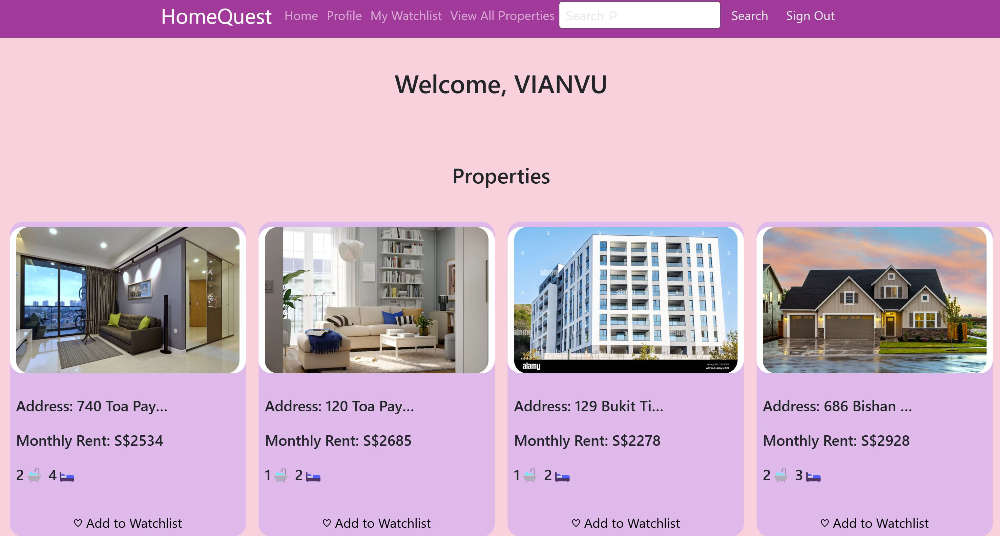
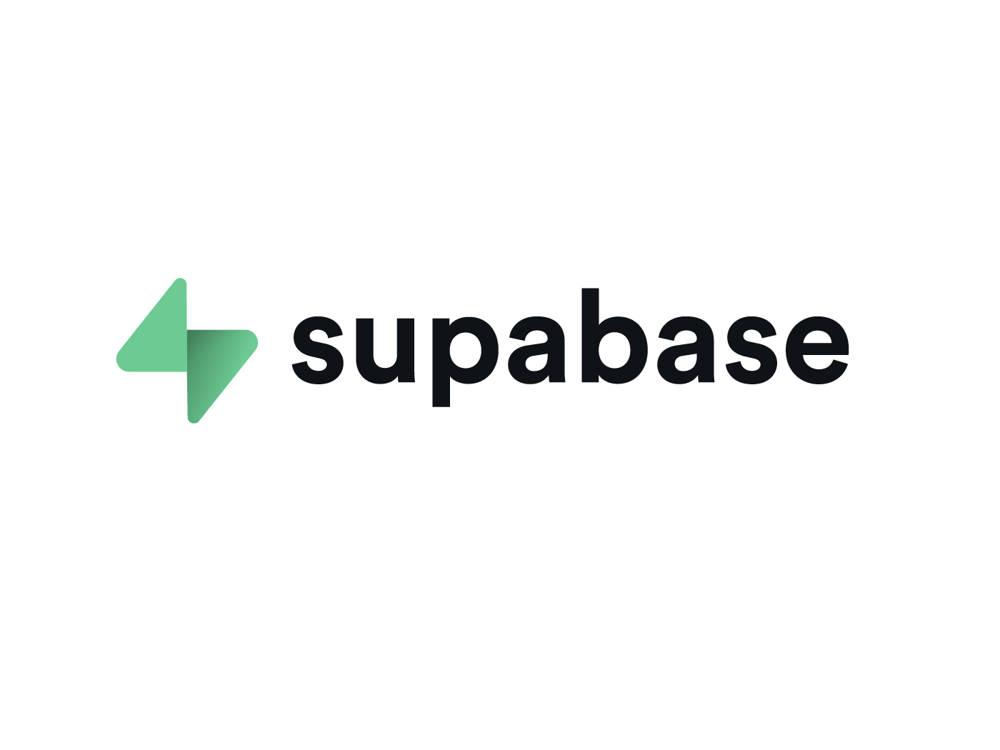

# HomeQuest 

Welcome to the official repository for NTU SC2006 Software Engineering group project HomeQuestHomeQuest.

<p align="center">
  
</p>
<p align="center">
  
</p>

## Introduction ##

HomeQuest is a website designed to help users navigate the Singapore housing market by recommending potential housing regions for investment, whether for renting or resale. It caters to many users, from first-time homeowners and property investors to tenants and landlords looking for optimal housing opportunities. 

## Website Purpose:

Our group understands the difficulties that peoplep face in securing affordable housing in Singpapore. The Smart Nation Initiative aims to use technology to empower Singapore's citizens. Our website, HomeQuest, embodies this vision by leveraging technology to address the specific challenge citizens nowadays face. HomeQuest provides a user friendly platform that will streamline the rental process as well as give some investment insights for potential investors, making it easier for our users to find a perfect place they can call home and investment opportunities in Singapore.

## Tech Stack:
<p align="center">
  
  
    
  
  
  
</p>

## Setup Instructions: ##

### Frontend

Firstly, clone this repo, then cd into your working directory:

Then run the following code to launch the front end:  

```
cd HomeQuest/frontend
```
Now in the frontend directory, create a file with the name **.env**

Inside the **.env** file, key in the following:  

**Note: Replace <...> with your own Supabase URL and Supabase ANON Key** 

```
VITE_SUPABASE_URL="<Your Supabase URL>"
VITE_SUPABASE_ANON_KEY="<Your Supabase ANON Key>"
```

### Backend 

Then in the backend directory, run the following: 

```
npm i
npm run dev
```

Open a new terminal.  

Then go back to the HomeQuest directory and  

```
cd backend
```

Now in the backend directory, create a file with the name **.env**  

Inside the **.env** file, key in the following:  

**Note: Replace <...> with your own secret key, MongoDB uri, Supabase URL, and Supabase ANON Key**  


```
JWT_SECRET=<Your secret key>
MONGO=<Your MongoDB uri>
VITE_SUPABASE_URL="<Your Supabase URL>"
VITE_SUPABASE_ANON_KEY="<Your Supabase ANON Key>"
PASSWORD="<Your generated app password from Google Account>"
EMAIL="<Your email address>"
```
Then in the backend directory, run the following:  

```
npm i
npm run dev
```

## Contributors ##
<div align="center">

| Name                    | GitHub Username                             |
|-------------------------|---------------------------------------------|
| Vu Thao Nguyen          | [neyvivu](https://github.com/neyvivu)       |
| Kushaan Nagpal          | [kushaan1](https://github.com/kushaan1)     |     
| Sudhishna Janavi        | [SudhishnaJanavi](https://github.com/SudhishnaJanavi)|
| Joshua Tan (Chen Kaijun)| [WashedDerpy](https://github.com/WashedDerpy)      |
| Sridhar Avneesh         | [avneeshsridhar1](https://github.com/avneeshsridhar1) |
| Rayapaty Yash           | [YashR2005](https://github.com/YashR2005) |

</div>

